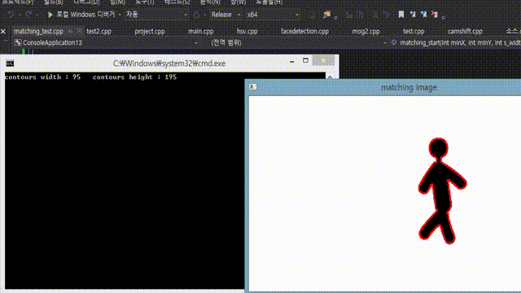
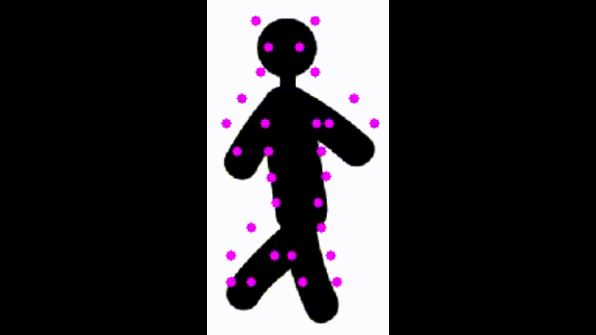

# image contour & points matching algorithm  
  
  

         

  
  
## Introduction  
  
  
>This program is coded for matching between coutoured image and feature points. They have different size and location. Also, they doesn't perfectly fit each other after adjusting the size and location. So our objective is **finding best matching result**. In this code, I tried my best to minimize computing cost.

## Manual  
  
  
This code runs step by step.  
  
  
1. If you build `matching_test.cpp` file, you can see a image having some points. Don't care about color. It just represents outer & inner points.  
  
2. type **`q`** key : It shows a human shaped image having red contour. The contour is our goal to find best matching result with points.  
  
3. type **`w`** key : Resizing points On the basis of contour's width.

4. type **`a`** key : Move points to location of contour.

5. type **`r`** key : Start matching. you can check the searching process correctly by changing the `bool bEscKey = false -> true`. Then you can see the process one by one by typing `ESC` key continuously.
  

## Environment  
  
  
#### software  
  
>Windows 8.1(x64), Visual studio 2013, OpenCV 2.4.9  
 
#### hardware  
  
>CPU : i3-4005U 1.72GHz, Memory : 6GB

